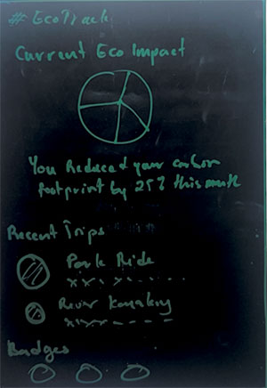

# 🌿 EcoTrack – Leave No Trace Tracker

A mobile app for hikers and nature enthusiasts to track eco-friendly actions, monitor environmental impact, and explore responsibly through gamified sustainability features.

---

## 📱 Key Features

- **Impact Logging** - Track trash pickup, recycling, zero-waste camping, and education activities
- **Trip Tracking** - GPS-enabled route recording with real-time environmental impact calculation
- **Achievement System** - Earn badges and build EcoScore through sustainable actions
- **Dashboard Analytics** - Visualize progress with waste removed, CO₂ offset, and actions logged
- **Offline Capability** - Works without internet during hikes with automatic sync

---

## ✅ Current Features

### Core Functionality
- ✅ **Action Logging System** - Multi-type eco-action tracking with impact calculation
- ✅ **Trip Management** - GPS tracking with start/pause/stop functionality and location recording
- ✅ **Real-time Dashboard** - Live statistics, recent actions, and achievement progress
- ✅ **Achievement Progress** - Badge system with milestone tracking and visual feedback
- ✅ **User Statistics** - Comprehensive impact metrics with real-time updates

### Technical Implementation
- ✅ **Modern Navigation** - Expo Router with file-based routing and tab/stack navigation
- ✅ **Authentication** - Firebase Auth with streamlined error handling and demo mode
- ✅ **Data Management** - AsyncStorage with event-driven architecture and offline support
- ✅ **Component Architecture** - Modular system with shared hooks and centralized utilities
- ✅ **Theme System** - Dynamic light/dark mode with Material Design 3 principles
- ✅ **Units System** - Imperial/Metric conversion with persistent preferences

### User Experience
- ✅ **Onboarding Flow** - Interactive multi-step setup with progress indicators
- ✅ **Profile Management** - Modular components with activity timeline and settings
- ✅ **Responsive Design** - Optimized layouts with proper safe area handling
- ✅ **Form Validation** - Comprehensive input validation with user feedback
- ✅ **Loading States** - Smooth transitions with proper loading indicators

---

## 🎨 Design System

Built with **Material Design 3** principles featuring:
- Clean card-based layouts with elevation and proper spacing
- Eco-friendly color palette reflecting nature themes
- Consistent typography optimized for outdoor readability
- Interactive elements with proper focus indicators and accessibility
- Seamless light/dark mode transitions for various lighting conditions
- Modular component architecture ensuring design consistency

---

## 📐 App Screenshots


*Authentication and onboarding flow*


*Main dashboard with impact visualization*


*Eco-action logging interface*



*User profile with comprehensive statistics*

---

## 🎯 Target Audience

- **Individual Hikers** - Track personal environmental impact during outdoor adventures
- **Camping Groups** - Coordinate eco-friendly practices and group achievements  
- **Outdoor Educators** - Teach Leave No Trace principles with gamified engagement
- **Park Rangers** - Monitor visitor impact and promote sustainable practices

---

## 🚀 Development Roadmap

### ✅ Phase 1: Foundation (Complete)
- Modern app architecture with TypeScript
- Firebase authentication and data persistence
- Material Design component library
- Navigation system with proper routing

### ✅ Phase 2: Core Features (Complete)  
- Action logging with impact calculation
- Trip tracking with GPS integration
- Real-time dashboard and statistics
- Achievement system and badge progress

### 🚧 Phase 3: Enhanced Features (In Progress)
- 🔜 Photo attachments for logged actions
- 🔜 Enhanced data visualization with charts
- 🔜 Offline data sync optimization
- 🔜 Advanced trip analytics and insights

### 📋 Phase 4: Community Features (Planned)
- Social profiles and action sharing
- Group challenges and leaderboards  
- Community cleanup coordination
- Park-specific tips and alerts

### 📋 Phase 5: Advanced Capabilities (Future)
- AI-powered image recognition for automatic logging
- Integration with fitness and outdoor apps
- Ranger dashboard for park impact monitoring
- Smart notifications based on location and weather

---

## 📦 Tech Stack

**Frontend & Mobile**
- Expo React Native with TypeScript
- Expo Router for file-based navigation
- Material Design 3 component system
- AsyncStorage for offline data persistence

**Authentication & Backend**
- Firebase Auth with error handling
- Event-driven architecture for real-time updates
- Centralized service layer for data management

**Development & Tools**
- Custom hooks for shared state management
- Modular component architecture
- Comprehensive form validation
- VS Code with Expo development tools

**Key Libraries**
- `expo-router` - File-based navigation system
- `expo-location` - GPS tracking for trips  
- `@expo/vector-icons` - Material Icons and Ionicons
- `react-native-safe-area-context` - Safe area handling
- `@react-native-async-storage/async-storage` - Data persistence

---

## 🛠️ Development Setup

1. **Clone and Install**
   ```bash
   git clone https://github.com/gilleon/ecoTrack.git
   cd ecoTrack
   npm install
   ```

2. **Environment Configuration**
   ```bash
   cp .env.example .env
   # Add Firebase configuration values
   ```

3. **Start Development**
   ```bash
   npx expo start
   ```

### Required Environment Variables
```env
EXPO_PUBLIC_FIREBASE_API_KEY=your-api-key
EXPO_PUBLIC_FIREBASE_AUTH_DOMAIN=your-project.firebaseapp.com
EXPO_PUBLIC_FIREBASE_PROJECT_ID=your-project-id
EXPO_PUBLIC_FIREBASE_STORAGE_BUCKET=your-project.appspot.com
EXPO_PUBLIC_FIREBASE_MESSAGING_SENDER_ID=your-sender-id
EXPO_PUBLIC_FIREBASE_APP_ID=your-app-id
```

### Project Structure
```
ecoTrack/
├── app/                    # Expo Router pages
│   ├── (auth)/            # Authentication screens
│   ├── (tabs)/            # Main app tabs
│   └── _layout.tsx        # Root layout
├── src/
│   ├── components/        # Reusable UI components
│   ├── contexts/          # React Context providers
│   ├── hooks/             # Custom React hooks
│   ├── screens/           # Screen components
│   ├── services/          # Data and API services
│   ├── types/             # TypeScript definitions
│   └── utils/             # Utility functions
└── assets/                # Images and static files
```

---

## 🔧 Key Architecture Features

**Event-Driven Updates**
- Global event emitter for real-time data synchronization
- Automatic component refresh without prop drilling
- Optimized performance with focused updates

**Modular Component System**
- Shared hooks (`useUserStats`, `useTrip`, `useActionForm`)
- Reusable UI components with consistent styling
- Centralized service layer for data operations

**Modern Navigation**
- File-based routing with Expo Router
- Type-safe navigation with proper error boundaries
- Tab and stack navigation with state persistence

**Offline-First Architecture**
- AsyncStorage for local data persistence
- Event emitter for component synchronization
- Automatic data refresh on app focus

---

## 📄 License

MIT License - see LICENSE file for details.
