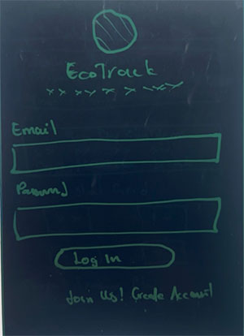
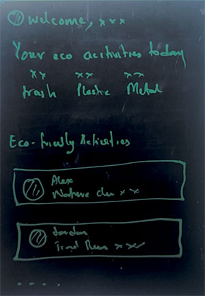
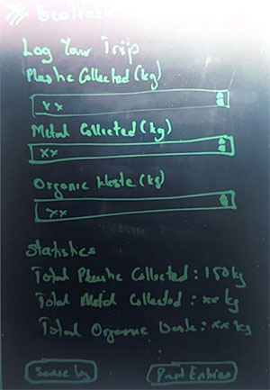

# 🌿 EcoTrack – Leave No Trace Tracker
EcoTrack is a mobile app designed for hikers and nature enthusiasts who want to explore responsibly and reduce their environmental footprint. The app empowers users to log eco-friendly actions during outdoor adventures and rewards them through gamified achievements and visual impact summaries.

---

## 📱 Key Features

- **Impact Logging**
  - Track actions like trash pickup and zero-waste camping
  - Geotag actions for trip summaries and map overlays
  - Works offline during hikes, with automatic cloud sync

- **Gamification & Badges**
  - Earn sustainability badges for completing eco-friendly behaviors
  - Level up as you log actions and build your EcoScore
  - Seasonal challenges with bonus rewards and community goals

- **Trip Summary & Impact Visualization**
  - See your progress: waste removed, CO₂ offset, and actions logged

- **Community & Collaboration**
  - Discover local eco-logs from fellow hikers
  - Participate in group cleanups and track team impact

- **Park Awareness & Education**
  - GPS-based tips aligned with local Leave No Trace guidelines
  - Alerts for fire bans, wildlife precautions, and trail updates

---

## ✅ Development Progress

### Completed Features
- ✅ **Onboarding Flow**
  - Interactive multi-step onboarding with eco-focused messaging
  - Smooth animations and progress indicators
  - Vector icon integration with MaterialIcons and Ionicons

- ✅ **Authentication System**
  - Firebase Auth integration with email/password
  - Secure sign-up and login with form validation
  - Persistent authentication state with AsyncStorage
  - Demo mode for testing without account creation

- ✅ **UI/UX Foundation**
  - Modular component architecture with reusable auth components
  - Theme system with consistent color scheme and typography
  - Material Design principles with custom styling
  - Responsive design with keyboard handling

### Technical Implementation
- **Authentication**: Firebase Web SDK with React Native persistence
- **State Management**: Context API for auth state and theme
- **Form Handling**: Custom hooks for validation and form state
- **Icons**: Expo Vector Icons (MaterialIcons, Ionicons)
- **Navigation**: Custom screen navigation system
- **TypeScript**: Full type safety throughout the app

---

## 🎨 Design System & Material Design

EcoTrack follows Google's Material Design 3 principles, creating an intuitive and accessible user experience that feels familiar to users while maintaining the app's eco-friendly identity. The design system emphasizes clean layouts, consistent spacing, and thoughtful use of color to guide users through their outdoor adventures.

The Material Design implementation includes elevated cards for content grouping, floating action buttons for primary actions like logging eco-activities, and a comprehensive color palette that reflects nature themes. Typography follows Material Design's type scale with custom weights optimized for outdoor readability, ensuring important information remains visible even in challenging lighting conditions.

Interactive elements like buttons, inputs, and navigation components utilize Material Design's state system with proper focus indicators, ripple effects, and accessibility features. The design system maintains consistency across all screens while allowing for contextual adaptations, such as high-contrast modes for outdoor use and simplified interfaces for quick action logging during hikes.

---

## 📐 App Wireframes

Below are the wireframes showcasing the user interface and flow of EcoTrack:



*Authentication screens with onboarding flow*



*Main dashboard showing current trip status and quick action logging*



*Interface for logging eco-friendly actions with geolocation*


*Visual impact summary with charts and exportable reports*

---

## 🎯 Target Audience

EcoTrack is built for:
- Individual hikers and backpackers
- Eco-conscious camping groups
- Outdoor organizations and educators
- Park rangers and trail stewards

Whether you're venturing solo or leading a group, EcoTrack helps you turn outdoor impact into progress.

---

## 🚀 Development Roadmap

### Phase 1: Foundation (✅ Complete)
- ✅ Project setup and architecture
- ✅ Authentication system with Firebase
- ✅ Onboarding experience
- ✅ Core UI component library
- ✅ Theme system and responsive design

### Phase 2: Core Features (🚧 In Progress)
- 🔜 Main dashboard and navigation
- 🔜 Impact logging interface
- 🔜 Trip tracking and GPS integration
- 🔜 Badge system and gamification
- 🔜 Settings and user profile

### Phase 3: Data & Visualization (📋 Planned)
- 🔜 Impact data storage and management
- 🔜 Trip summaries with charts
- 🔜 Progress tracking and statistics
- 🔜 Offline data sync capabilities

### Phase 4: Social & Community (📋 Future)
- 🔜 User profiles and social features
- 🔜 Community eco-logs and sharing
- 🔜 Group cleanups and team tracking
- 🔜 Leaderboards and challenges

### Phase 5: Advanced Features (📋 Future)
- 🔜 Smart logging with image recognition
- 🔜 Park-specific tips and alerts
- 🔜 Ranger dashboard for park statistics
- 🔜 Activity syncing with fitness apps

---

## 📦 Tech Stack

- **Frontend**: Expo React Native with TypeScript
- **Authentication**: Firebase Auth with AsyncStorage persistence
- **UI Framework**: Custom component library with Material Design principles
- **Icons**: Expo Vector Icons (MaterialIcons, Ionicons)
- **State Management**: React Context API
- **Backend**: Firebase (Authentication, planned: Firestore)
- **Planned Sensors**: GPS, camera, barometer
- **Development Tools**: VS Code, Expo CLI, Git

---

## 🛠️ Development Setup

1. **Clone the repository**
   ```bash
   git clone https://github.com/gilleon/ecoTrack.git
   cd ecoTrack
   ```

2. **Install dependencies**
   ```bash
   npm install
   ```

3. **Set up environment variables**
   ```bash
   cp .env.example .env
   # Add your Firebase configuration values
   ```

4. **Start development server**
   ```bash
   npx expo start
   ```

### Environment Variables Required
```
EXPO_PUBLIC_FIREBASE_API_KEY=your-api-key
EXPO_PUBLIC_FIREBASE_AUTH_DOMAIN=your-project.firebaseapp.com
EXPO_PUBLIC_FIREBASE_PROJECT_ID=your-project-id
EXPO_PUBLIC_FIREBASE_STORAGE_BUCKET=your-project.appspot.com
EXPO_PUBLIC_FIREBASE_MESSAGING_SENDER_ID=your-sender-id
EXPO_PUBLIC_FIREBASE_APP_ID=your-app-id
```

---

## 📄 License

This project is licensed under the MIT License - see the LICENSE file
